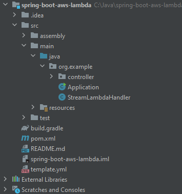
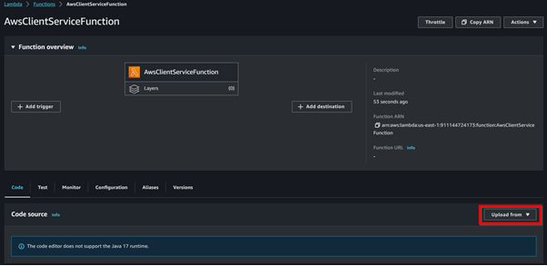
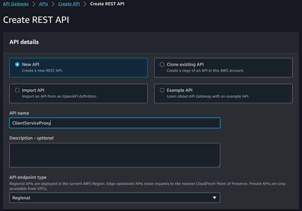

# aws-client-service serverless API

## Introduction
We are going to deploy spring-boot lambda service application in AWS Lambda.
This is a simple rest-api, with 3 services. create, getAll and getById.

The aws-client-service project, created with [`aws-serverless-java-container`](https://github.com/awslabs/aws-serverless-java-container).
The project folder also includes a `template.yml` file. You can use this [SAM](https://github.com/awslabs/serverless-application-model) file to deploy the project to AWS Lambda and Amazon API Gateway or test in local with the [SAM CLI](https://github.com/awslabs/aws-sam-cli). 

## Pre-requisites
* [AWS Account](https://console.aws.amazon.com/)
* [Gradle](https://gradle.org/) or [Maven](https://maven.apache.org/)

**OBS.**: In this project, we are using H2 database, which is an in memory database. AWS Lambda will generally terminate functions after 45–60 minutes of inactivity and close the connection with database.
After that, we lose our data in database, because H2 is an in memory database. you can use one of the RDS from AWS console.

## Building the project
You can create the base project with command line arguments or via Intellij

Command line:
```bash
$ mvn archetype:generate -DartifactId=aws-client-service -DarchetypeGroupId=com.amazonaws.serverless.archetypes -DarchetypeArtifactId=aws-serverless-jersey-archetype -DarchetypeVersion=2.0.0-M2 -DgroupId=org.example -Dversion=1.0-SNAPSHOT -Dinteractive=false
```
IntelliJ:


The project structure:



After download the project, run the command:
```bash
$ mvn clean package
```

Now we should create our lambda function in AWS console.
Go to AWS console>AWS Lambda function>Create function, and save it.


Upload your project package(/target/*.zip), before you create it with "mvn clean package".



Edit your runtime settings and change the handler classPath.


Let's create an API Gateway.
Go to AWS console>API Gateway>Create API>REST API, and save it.

Create REST API:



Create the resources:


Create methods(POST):


Let's test our POST method:


The response status is 201, the client created successfully.

Once you create all the resources and methods you need, you can deploy the API Gateway.


You can test your lambda function with postman.
Go to AWS console>API Gateway>APIs>ClientServiceProxy>Stages
Get the url, and call it with postman:


That's All Folks!